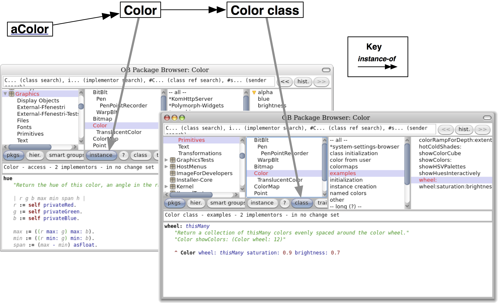

##The Smalltalk object model

<a name="cha:model"></a>

Smalltalk's programming model is simple and uniform: everything is an object, and objects communicate only by sending each other messages\.
However, this simplicity and uniformity can be a source of difficulty for programmers used to other languages\. In this chapter we present the core concepts of the Smalltalk object model; in particular we discuss the consequences of representing classes as objects\.


###1\. The rules of the model

<a name="sec:rules"></a>

The Smalltalk object model is based on a set of simple
rules that are applied *uniformly*\. The rules are as follows:


-  **Rule 1**\. Everything is an object\.
-  **Rule 2**\. Every object is an instance of a class\.
-  **Rule 3**\. Every class has a superclass\.
-  **Rule 4**\. Everything happens by sending messages\.
-  **Rule 5**\. Method lookup follows the inheritance chain\.


Let us look at each of these rules in some detail\.


###2\. Everything is an Object


The mantra *everything is an object* is highly contagious\.
After only a short while working with Smalltalk, you will start to be surprised at how this rule simplifes everything you do\.
Integers, for example, are truly objects, so you can send messages to them, just as you do to any other object\.


```smalltalk
3 + 4            --> 7    "send '+ 4' to 3, yielding 7"
20 factorial  --> 2432902008176640000   "send factorial, yielding a big number"
```


The representation of `20 factorial` is certainly different from the representation of `7`, but because they are both objects, none of the code ,not even the implementation of `factorial`, needs to know about this\.


Perhaps the most fundamental consequence of this rule is the following:

&nbsp;
<p class="important">**Classes are objects too\.**</p>Furthermore, classes are not second\-class objects: they are really first\-class objects that you can send messages to, inspect, and so on\.
This means that Pharo is a truly reflective system, which gives a great deal of expressive power to developers\.

Deep in the implementation of Smalltalk, there are three different kinds of objects\.  There are \(1\) ordinary objects with instance variables that are passed by references, there are \(2\) *small integers* that are passed by value, and there are \(3\) indexable objects like arrays that hold a contiguous portion of memory\.  The beauty of Smalltalk is that you normally don't need to care about the differences between these three kinds of object\.


###3\. Every object is an instance of a class


Every object has a class; you can find out which by sending it the message `class`\.


```smalltalk
1 class                 --> SmallInteger
20 factorial class --> LargePositiveInteger
'hello' class          --> ByteString
#(1 2 3) class       --> Array
(4@5) class         --> Point
Object new class --> Object
```


A class defines the *structure* of its instances via instance variables,
and the *behavior* of its instances via methods\.
Each method has a name, called its *selector*, which is unique within the class\.

Since *classes are objects*, and *every object is an instance of a class*, it follows that classes must also be instances of classes\.
A class whose instances are classes is called a *metaclass*\.
Whenever you create a class, the system automatically creates a metaclass for you\.
The metaclass defines the structure and behavior of the class that is its instance\.
99%  of the time you will not need to think about metaclasses, and may happily ignore them\.
\(We will have a closer look at metaclasses in Chapter 13\)


####3\.1\. Instance variables


Instance variables in Smalltalk are private to the *instance* itself\.
This is in contrast to Java and C\+\+, which allow instance variables \(also known as *fields* or *member variables*\) to be accessed by any other instance that happens to be of the same class\. We say that the *encapsulation boundary* of objects in Java and C\+\+ is the class, whereas in Smalltalk it is the instance\.


In Smalltalk, two instances of the same class cannot access each other's instance variables unless the class defines *accessor methods*\.There is no language syntax that provides direct access to the instance variables of any other object\.\(Actually, a mechanism called reflection does provide a way to ask another object for the values of its instance variables; meta\-programming is intended for writing tools like the object inspector, whose sole purpose is to look inside other objects\.\)

Instance variables can be accessed by name in any of the instance methods of the class that defines them, and also in the methods defined in its subclasses\. This means that Smalltalk instance variables are similar to *protected* variables in C\+\+ and Java\. However, we prefer to say that they are private, because it is considered bad style in Smalltalk to access an instance variable directly from a subclass\.


#####3\.1\.1\. Example

Method `Point>>dist:` computes the distance between the receiver and another point\. The instance variables `x` and `y` of the receiver are accessed directly by the method body\.  However, the instance variables of the other point must be accessed by sending it the messages `x` and `y`\.


```smalltalk
Point>>>dist: aPoint
    "Answer the distance between aPoint and the receiver."
    | dx dy |
    dx := aPoint x - x.
    dy :=  aPoint y - y.
    ^ ((dx * dx) + (dy * dy)) sqrt
```


```smalltalk
1@1 dist: 4@5 --> 5.0
```


The key reason to prefer instance\-based encapsulation to class\-based encapsulation is that it enables different implementations of the same abstraction to coexist\. For example, method `point>>>dist:`, need not know or care whether the argument `aPoint` is an instance of the same class as the receiver\.  The argument object might be represented in polar coordinates, or as a record in a database, or on another computer in a distributed system; as long as it can respond to the messages `x` and `y`, the code in mthref\{dist:\} will still work\.


####3\.2\. Methods


All methods are public\.footnote\{Well, almost all\.  In Pharo, methods whose selectors start with the string `pvt` are private: a `pvt` message can be sent *only* to self\.  However, `pvt` methods are not used very much\.\}
Methods are grouped into protocols that indicate their intent\.
Some common protocol names have been established by convention, for example, `accessing` for all accessor methods, and `initialization` for establishing a consistent initial state for the object\.
The protocol `private` is sometimes used to group methods that should not be seen from outside\.
Nothing, however, prevents you from sending a message that is implemented by such a *private* method\.

Methods can access all instance variables of the object\.
Some Smalltalk developers prefer to access instance variables only through accessors\.
This practice has some value, but it also clutters the interface of your classes, and worse, exposes private state to the world\.


####3\.3\. The instance side and the class side


Since classes are objects, they can have their own instance variables and their own methods\.
We call these *class instance variables* and *class methods*, but they are really no different from ordinary instance variables and methods:
class instance variables are just instance variables defined by a metaclass, and class methods are just methods defined by a metaclass\.


A class and its metaclass are two separate classes, even though the former is an instance of the latter\.
However, this is largely irrelevant to you as a programmer: you are concerned with defining the behavior of your objects and the classes that create them\.

<a name=""></a><figure></img><figcaption>Browsing a class and its metaclass For this reason, the browser  helps you to browse both class and metaclass as if they were a single thing with two ''sides'': the ''instance side'' and the ''class side'', as shown in Figure *fig:Buttons*. Clicking on the \button{instance} button browses the class ==Color==, ''i.e.'', you browse the methods that are executed when messages are sent to an instance of ==Color==, like the blue color. Pressing the \button{class} button browses the class ==Color class==, ''i.e.'', you see the methods that will be executed when messages are sent to the class ==Color== itself. For example, ==Color blue== sends the message ==blue== to the class ==Color==. You will therefore find the method ==blue== defined on the class side of ==Color==, not on the instance side.</figcaption></figure>


